# Supplementary Material

---

## 1. 

  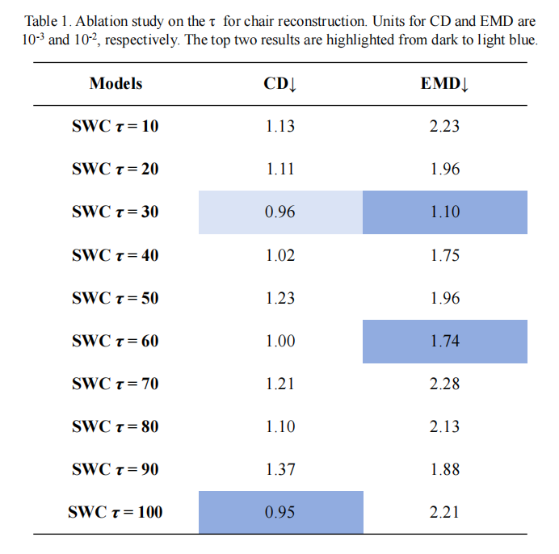

 

  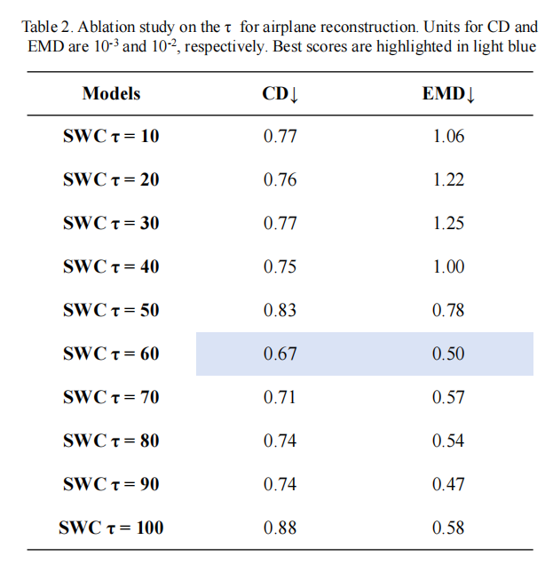

---

## 2. 

  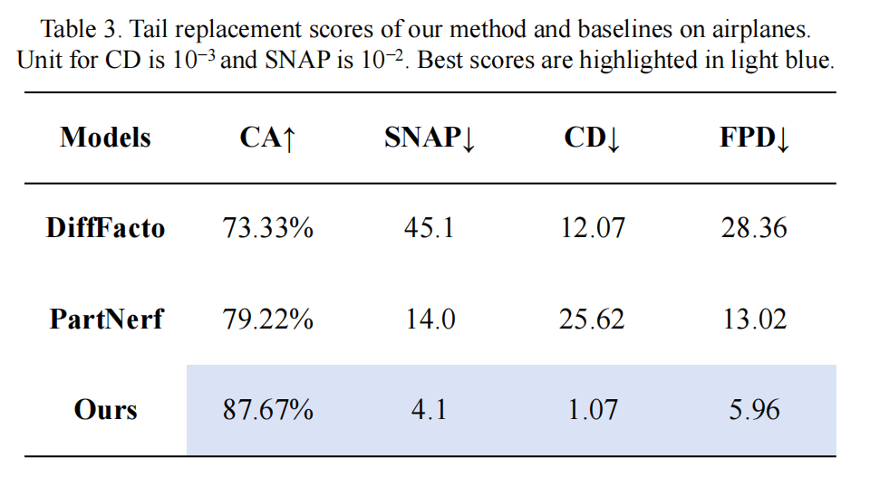

 

  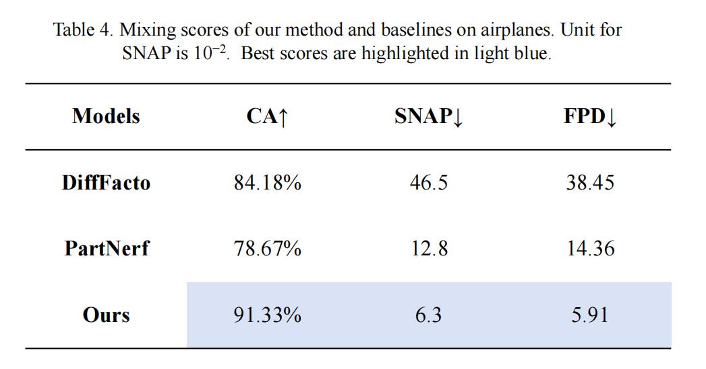

 

  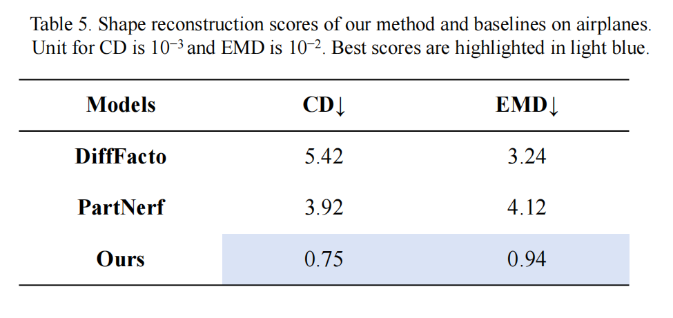

---

## 3.

  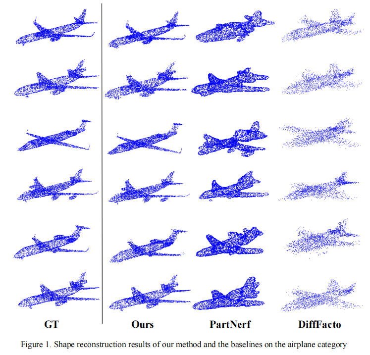
   

 

  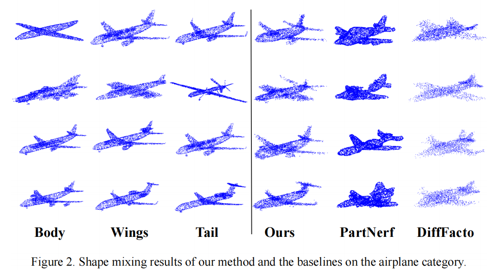
   

 

  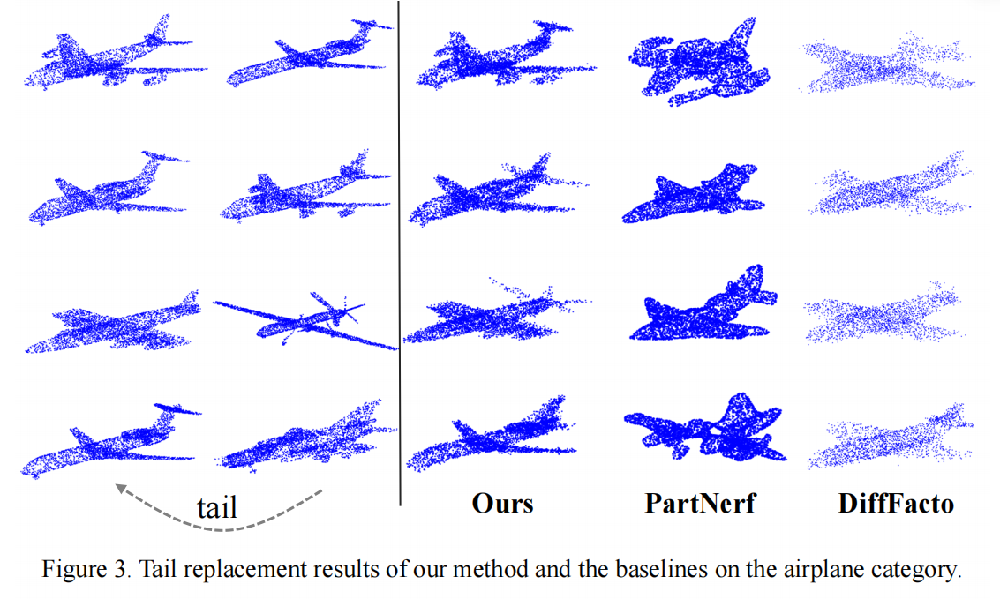
   

---

## 4. 

### Sample 1

  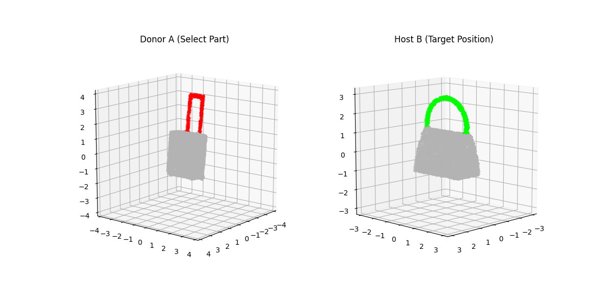
   
  <b>Figure 4.</b> The regions selected for editing (Sample 1).

 

  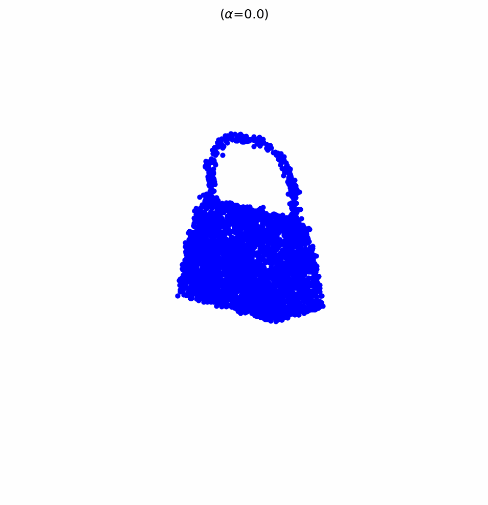
   
  <b>Figure 5.</b> The iterative generation process into a square shape.

 

### Sample 2

  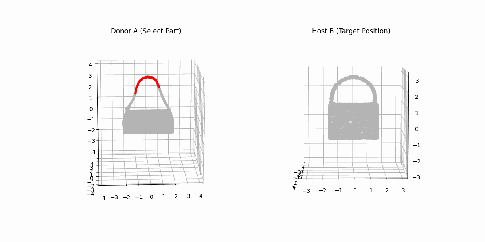
   
  <b>Figure 6.</b> The interactive process of selecting the editing region.

 

  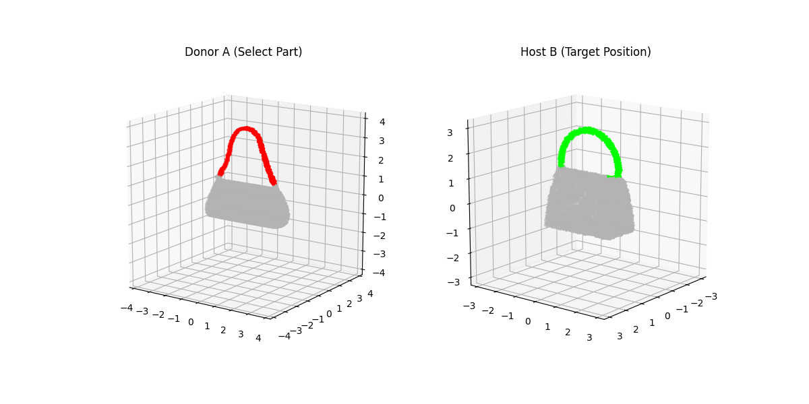
   
  <b>Figure 7.</b> The input regions and target deformation setup (Sample 2).

 

  
   
  <b>Figure 8.</b> The iterative generation process into a concave shape.
